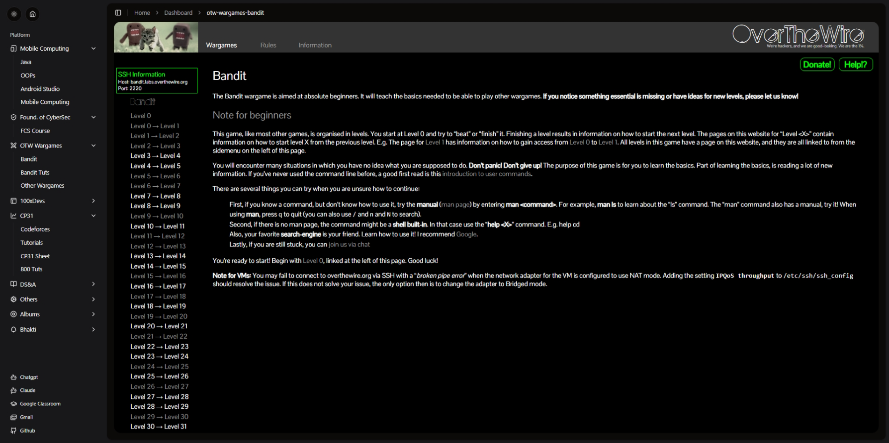

# कर्मOS (KarmOS)

**KarmOS** is a distraction-free, learning-focused platform designed to help users stay engaged and uninterrupted. It eliminates advertisements, attention-grabbing bots, and unnecessary distractions, allowing you to focus solely on learning through lectures, tutorials, and documentation.


---

## Table of Contents

- [कर्मOS (KarmOS)](#कर्मos-karmos)
  - [](#)
  - [Table of Contents](#table-of-contents)
  - [About](#about)
  - [Features](#features)
  - [Tech Stack](#tech-stack)
  - [Installation](#installation)
  - [Usage](#usage)
  - [File Structure](#file-structure)
  - [Contribution](#contribution)
    - [Made with 💚 by KintsugiDevStudios](#made-with--by-kintsugidevstudios)

---

## About

KarmOS creates an environment free from brainrots (distractions) by providing:
- Ad-free browsing
- No attention-grabbing bots
- A focus on educational materials like lectures, tutorials, and documents

Designed with love by **KintsugiDevStudios**.

---

## Features

1. **Distraction-Free Dashboard**: Access all resources without interruptions.
2. **Customizable Learning Experience**:
   - Theme switching (dark/light mode)
   - UI personalization with intuitive design
3. **Content Organization**:
   - Tutorials grouped by categories
   - Advanced sidebar navigation
4. **Built-In Tools**:
   - Collapsible containers
   - Scroll animations
   - User avatar management
5. **Responsive Design**:
   - Optimized for mobile and desktop use
6. **No Advertisements**: A clean interface for focused learning.

---

## Tech Stack

- **Framework**: [Next.js 14](https://nextjs.org/)
- **Styling**: [TailwindCSS](https://tailwindcss.com/)
- **Language**: [TypeScript](https://www.typescriptlang.org/)
- **UI Components**: [ShadcnUI](https://shadcn.dev/)

---

## Installation

To set up the project locally:

1. **Clone the Repository**:
   ```bash
   git clone https://github.com/your-username/karmos.git
   cd karmos
   ```

2. **Install Dependencies**:
   ```bash
   npm install
   ```

3. **Run the Development Server**:
   ```bash
   npm run dev
   ```
   The application will be accessible at `http://localhost:3000`.

---

## Usage

1. Navigate to the dashboard: `/dashboard`.
2. Explore categorized tutorials, lectures, and resources.
3. Customize your experience with theme options and preferences.

---

## File Structure

```plaintext
.
├── app/
│   ├── dashboard/
│   │   ├── page.tsx            # Main dashboard page
│   │   └── tuts/
│   │       └── [slug]/
│   │           └── page.tsx    # Tutorial pages by slug
│   ├── layout.tsx              # Global layout
│   ├── globals.css             # Global styles
│   └── page.tsx                # Landing page
├── components/
│   ├── ui/                     # Reusable UI components
│   ├── buttons/                # Button components
│   ├── Nav.tsx                 # Navigation bar
│   ├── theme-provider.tsx      # Theme switching logic
│   └── toggle-dark.tsx         # Dark mode toggle
├── data/
│   ├── linksdict.json          # Links metadata
│   ├── videosdict.json         # Video metadata
│   └── rough.json              # Placeholder data
├── hooks/
│   └── use-mobile.tsx          # Custom mobile detection hook
├── lib/
│   └── utils.ts                # Utility functions
├── public/
│   ├── adv1.png                # Advertisement placeholder
│   ├── android-chrome-192x192.png
│   ├── favicon.ico
│   └── apple-touch-icon.png
├── tailwind.config.ts          # TailwindCSS configuration
└── tsconfig.json               # TypeScript configuration
```

---

## Contribution

We welcome contributions from the community! Please follow these steps:

1. Fork the repository.
2. Create a new branch:
   ```bash
   git checkout -b feature-name
   ```
3. Commit your changes:
   ```bash
   git commit -m "Add your message"
   ```
4. Push to the branch:
   ```bash
   git push origin feature-name
   ```
5. Open a Pull Request.

---

### Made with 💚 by [KintsugiDevStudios](https://kintsugidevstudios.com)